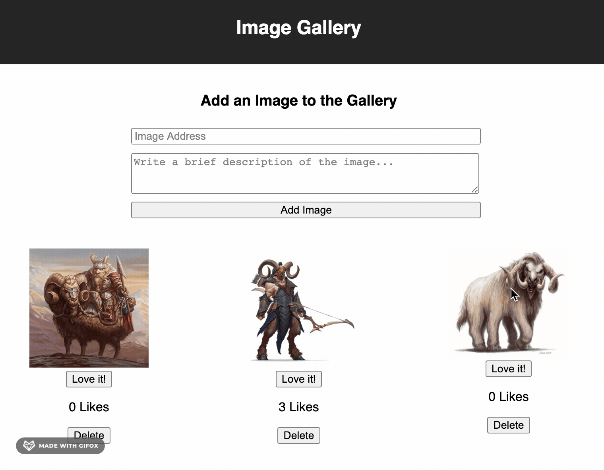
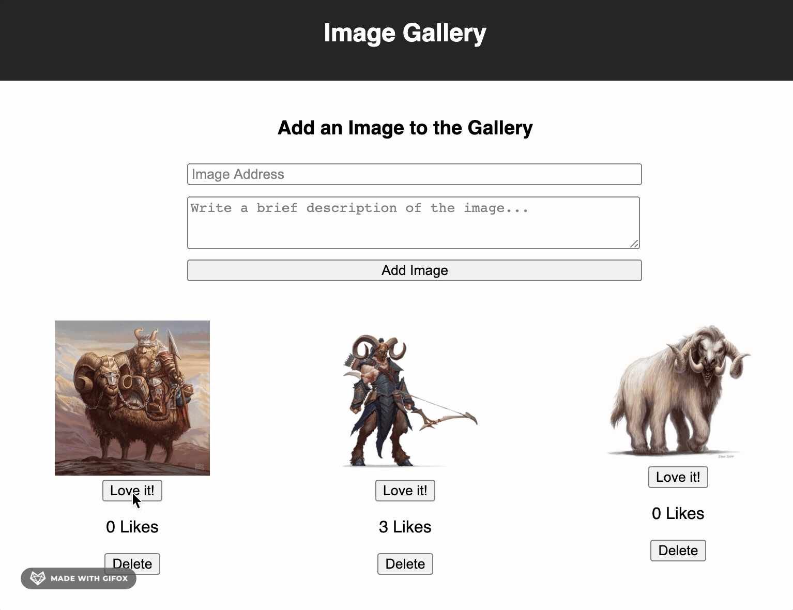
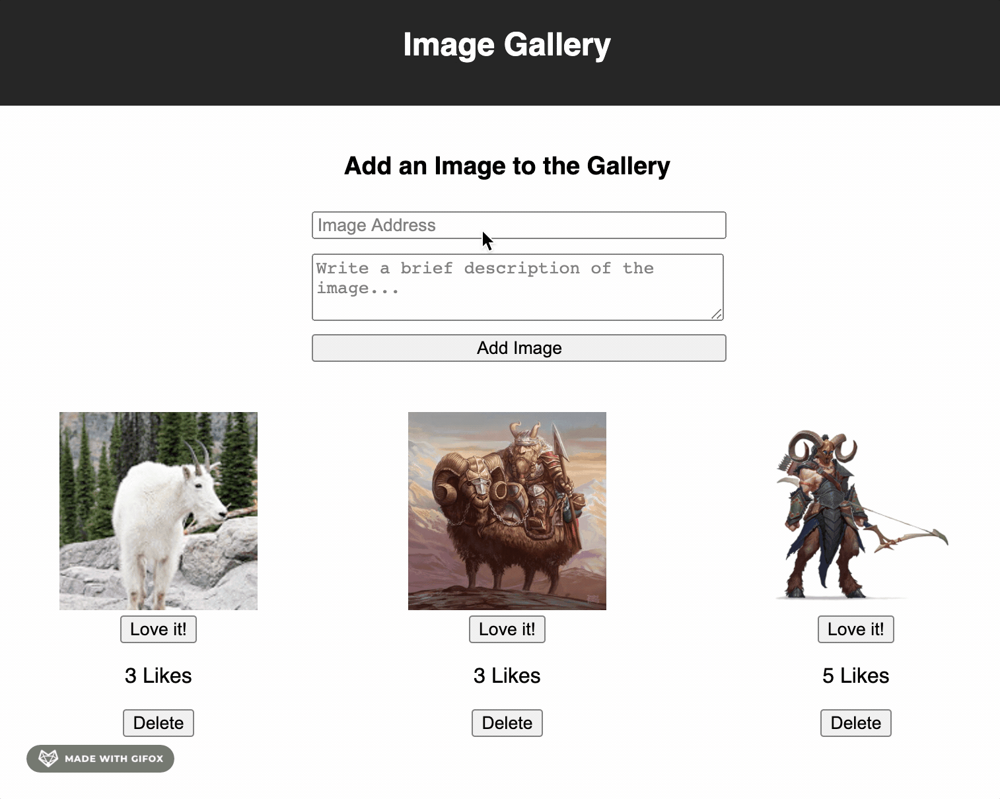

# Image Gallery App

## Description 
_Duration: Weekend Sprint_

The Image Gallery App uses React to render a list of images to the DOM, that each have their own like and delete button. When the user clicks on a photo, the image disappears and text description is rendered. To bring the image back, the user can simply click on the now displayed description text. When the user clicks a like button, it increments the total number of likes for that image, which is stored in a database along with the images and descriptions. The delete function allows a user to delete each photo from the gallery.

An input form has been implemented to allow the user to add more photos and descriptions with it. The number of likes is set to 0 on submission at default. After the image path and description have been submitted, they are immediately rendered to the page. Byy implementing a image submission form, the user can upload photos that would make them smile.

## Screen Shot

### Prerequisites
The following software are needed to install the app

- [Node.js](https://nodejs.org/en/)
- [React.js](https://reactjs.org/)
- [Postico](https://eggerapps.at/postico/)

## Installation

1. Create a database named `react_gallery`
2. The queries in the `database.sql` file are set up to create the necessary table and populate the data to all the application to run correctly.The project is built on [Postgres](https://www.postgresql.org/download/), so you will need to make sure to have that installed. We recommend using Postico to run those queries as that was used to create the queries.
3. Open your editor of choice and run an `npm install`.
4. Run `npm run server` in your terminal
5. In a second terminal run `npm run client`
6. The `npm run client` command will open a browser for you.

## Usage

1. The user has a collection of photos used in this app.
2. The user loves to spend time scrolling through the different photos, sharing memories. 
3. Some photos, the user can't quite remember what was going on in them, so they click the photo to see the description that was posted with the image.
4. After reading the user wants to take a closer look at that photo again, so they click the image to toggle back to the photo.
5. The user remembers how much they loved this moment, they hit that like button and watch the likes on the photo increment. 
6. The user decides they will post another photo, luckily they just found a great image of a beach that reminds them of their last trip to Hawaii.
7. The user copies and pastes the image path into the correct field, and then writes out a description in the larger text field. 
8. After looking it over, they hit the submit button and the image appears on the list.
9. Oops! That was the wrong photo. No worries, there is a delete button under the new image that the user can click to delete that mistake.

## Built With

This app was built with javascript, html, CSS,  React, and Node.

## Acknowledgement
Thanks to [Prime Digital Academy](www.primeacademy.io) who equipped and helped me to make this application a reality. Thanks to my classmates who helped iron out issues and solidify my knowledge.